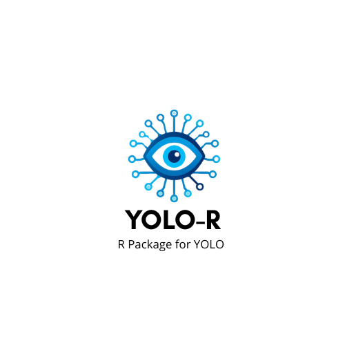

# YOLO-R 

### **R-Native YOLO Object Detection**

*The inference companion to ShinyLabel*

<p align="center">
  
</p>

<h1 align="center">YOLO-R</h1>
<p align="center">Package for the YOLO based object detection in R</p>

[](LICENSE)
[](https://cran.r-project.org/)

`yolor` closes the loop between ShinyLabel annotations and YOLO model training/inference — entirely within R.

```
ShinyLabel  ──►  annotate images (bounding boxes, classes)
                    │
                    ▼  SQLite .db
yolor       ──►  sl_read_db()  ──►  sl_export_dataset()
                    │
                    ▼  YOLO dataset
                yolo_train()   ──►  yolo_detect()  ──►  plot / export
```

---

## Installation

```r
# Install dependencies
install.packages(c(
  "reticulate", "DBI", "RSQLite", "magick", "ggplot2",
  "dplyr", "jsonlite", "yaml", "fs", "cli", "rlang",
  "glue", "tibble"
))

# Install yolor
devtools::install_github("Lalitgis/yolor")

# Set up the Python backend (Ultralytics YOLOv8)
library(yolor)
yolo_setup()
```

---

## Quick Start

```r
library(yolor)
reticulate::use_virtualenv("yolor")

# 1. Read ShinyLabel annotations
ds <- sl_read_db("project.db")
print(ds)
plot(ds)  # class distribution

# 2. Export to YOLO dataset
sl_export_dataset(ds, output_dir = "dataset/", val_split = 0.2)

# 3. Load + train
model  <- yolo_model("yolov8n")          # auto-downloads weights
result <- yolo_train(model,
                     data   = "dataset/data.yaml",
                     epochs = 100)

# 4. Detect in new images
preds <- yolo_detect(result, images = "new_images/", conf = 0.4)
print(preds)
plot(preds, image = "new_images/photo01.jpg")

# 5. Accuracy metrics
m <- yolo_metrics(result, data = "dataset/data.yaml")
print(m)
plot(m, type = "dashboard")
metrics_export(m, dir = "metrics/")
```

---

## Key Functions

**ShinyLabel integration**

| Function | Description |
|----------|-------------|
| `sl_read_db(path)` | Read a ShinyLabel SQLite database |
| `sl_read_csv(path)` | Read a ShinyLabel CSV export |
| `sl_export_dataset(ds, dir)` | Write YOLO `images/` + `labels/` + `data.yaml` |
| `sl_class_summary(ds)` | Annotation counts per class |

**Roboflow integration**

| Function | Description |
|----------|-------------|
| `rf_load_yolo(dir)` | Load a Roboflow YOLOv8 export (no conversion needed) |
| `rf_coco_to_yolo(dir)` | Convert Roboflow COCO JSON export to YOLO layout |
| `rf_read_csv(path)` | Read a Roboflow CSV export |
| `rf_download(workspace, project, version)` | Download directly from Roboflow API |
| `rf_summary(dir)` | Quick dataset overview |

**Models**

| Function | Description |
|----------|-------------|
| `yolo_setup()` | Install Ultralytics Python backend |
| `yolo_model(weights)` | Load a YOLOv8 model |
| `yolo_available_models()` | List pre-trained YOLOv8 sizes |

**Training & inference**

| Function | Description |
|----------|-------------|
| `yolo_train(model, data)` | Fine-tune on your dataset |
| `yolo_detect(model, images)` | Run inference |
| `yolo_validate_dataset(dir)` | Sanity-check dataset structure |

**Accuracy metrics**

| Function | Description |
|----------|-------------|
| `yolo_metrics(model, data)` | Full metrics via Ultralytics validation |
| `metrics_from_predictions(pred, gt)` | Pure-R metrics from detection tibbles |
| `metrics_export(metrics, dir)` | Export CSV / JSON / PNG / HTML report |
| `metrics_compare(m1, m2)` | Side-by-side model comparison |

**Utilities**

| Function | Description |
|----------|-------------|
| `yolo_export_csv(results, path)` | Save detections to CSV |
| `yolo_export_geojson(results, path)` | Save detections to GeoJSON |
| `yolor_example_db()` | Path to bundled example ShinyLabel database |

---

## Supported Models

| Model | Params | Speed | Best for |
|-------|--------|-------|----------|
| `yolov8n` | 3.2M | ⚡⚡⚡ | Edge / real-time |
| `yolov8s` | 11.2M | ⚡⚡ | Balanced |
| `yolov8m` | 25.9M | ⚡ | General purpose |
| `yolov8l` | 43.7M | 🐢 | High accuracy |
| `yolov8x` | 68.2M | 🐢🐢 | Maximum accuracy |

---

## Architecture

```
yolor/
├── DESCRIPTION
├── NAMESPACE
├── NEWS.md
├── R/
│   ├── yolor-package.R      # Package docs & global imports
│   ├── sl_read.R            # ShinyLabel DB/CSV reader & exporter
│   ├── roboflow.R           # Roboflow annotation adapter
│   ├── yolo_model.R         # Model loading (Ultralytics / torch)
│   ├── yolo_train.R         # Training wrapper
│   ├── yolo_detect.R        # Inference + plotting
│   ├── yolo_metrics.R       # Accuracy metrics computation
│   ├── yolo_metrics_plot.R  # PR / F1 / confusion / radar plots
│   ├── yolo_metrics_export.R# CSV / JSON / PNG / HTML export
│   ├── utils.R              # GeoJSON export, dataset validation
│   └── examples.R           # Bundled example data helpers
├── inst/
│   └── extdata/
│       └── example_annotations.db  # Bundled ShinyLabel example DB
├── tests/testthat/
│   ├── test-sl-read.R
│   ├── test-roboflow.R
│   ├── test-metrics.R
│   ├── test-yolo-core.R
│   ├── test-utils.R
│   └── test-extdata.R
└── vignettes/
    └── getting-started.Rmd
```

---

## License

MIT © Lalit BC
